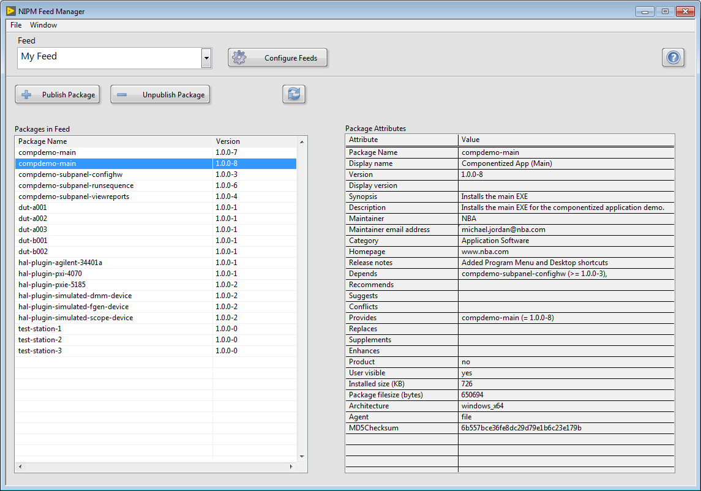
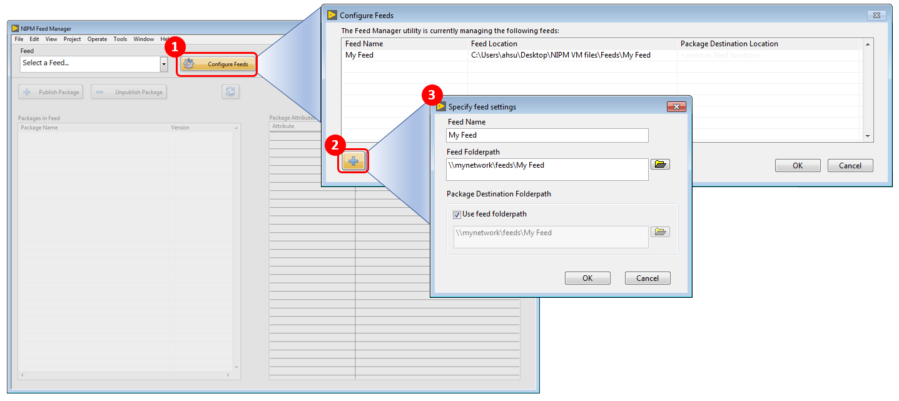
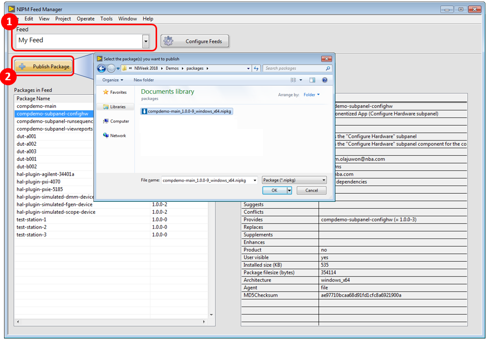

# nipm-feed-manager-gui-labview
NIPM Feed Manager GUI (Beta) for LabVIEW 2014 or later.

## Overview
The NIPM Feed Manager GUI is an out-of-the-box tool for managing NIPM feeds (e.g. create feed, add packages to feed, remove packages from feed, etc).  Please feel free to use this tool, give feedback, and contribute.

You can use this NIPM Feed Manager GUI to do the following:
* Create new feed(s)
* Manage existing feeds
* Browse packages in a feed
* View a package's attributes (name, version, release notes, dependencies, ...)
* Publish (add) packages to a feed
* Unpublish (remove) packages from a feed

You can find content, tutorials, and additional tools for NI package management at [bit.ly/nipkg](http://bit.ly/nipkg)

## How to Install
Prerequisites:
* LabVIEW 2014 or later
* [NI Package Manager](http://www.ni.com/downloads/ni-package-manager) 17.5 or later
* [NIPM API (Beta)](https://github.com/allenh-ni/nipm-api-labview/tree/master/Exports)
* Operating System: Refer to the OS requirements for NI Package Manager

Installation instructions
1. Click on the [Exports](https://github.com/allenh-ni/nipm-feed-manager-gui-labview/tree/master/Exports) folder, and download the most recent .vip file (VIPM package).
2. Double-click the .vip file.  This will launch VI Package Manager to install the NIPM Feed Manager to LabVIEW 2014 or later.

## How to Use
### Create (or add existing) feed
In LabVIEW, launch the NIPM Feed Manager GUI by selecting **Tools»NIPM Feed Manager»NIPM Feed Manager** from the LabVIEW toolbar.
Create a feed, as shown below.

### Publish/Unpublish a package to a feed
1. Select a feed.
2. Click the **Publish Package** button, and select the package(s) that you want to publish to the feed. This will 1) copy the package to the specified package destination folder for the feed, and 2) add the package to the feed.
3. Your package should now show up in the Packages in Feed listbox. You can click your package to view its package attributes (metadata) in the Package Attributes table on the right.
4. If you need to remove a package from the feed (e.g. old version of package that has a critical bug), then select the package and click the **Unpublish Package** button.

You can find content, tutorials, and additional tools for NI package management at [bit.ly/nipkg](http://bit.ly/nipkg)

## How to Customize the Feed Manager
Launching the NIPM Feed Manager launches a VI. The VI resides in the `<labview>\project\NIPM Feed Manager` directory. You can modify the VI to suit your needs.

If you decide to customize the VI, make sure to save a backup copy of your modifications elsewhere.  If you upgrade/uninstall the NIPM Feed Manager VIPM package in the future, it will remove/overwrite the installed files (e.g. Feed Manager.vi) causing you to lose your modifications.

## Support
This NIPM Feed Manager GUI is not officially supported by National Instruments. You can use this GitHub repository to find the source code, report issues, and contribute.

## Source Code
* **Source** folder - Contains the source code.  The Feed Manager uses the [NIPM API (Beta)](https://github.com/allenh-ni/nipm-api-labview/tree/master/Exports).
* **Build Spec** folder - Contains the VIPM build spec (.vipb) used to create the .vip file.
* **Export** folder - Contains versions of the VIPM package (.vip), which you can use to install this NIPM Feed Manager.
